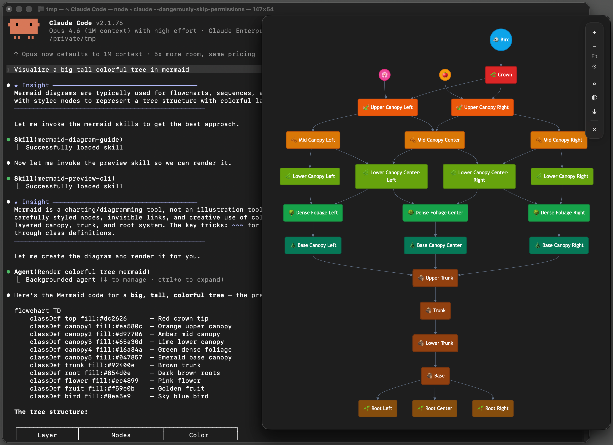

# mermaid-preview-cli

Lightweight CLI for AI agents and developers to preview Mermaid diagrams in a native frameless window (macOS).

<p align="center">
  
</p>

Designed for AI coding agents (Claude Code, etc.) to visualize diagrams mid-conversation via stdin, and for developers to live-preview diagram files.

## Why

- **One pipe, one window.** `echo "graph LR; A-->B" | mermaid-preview-cli` — done.
- **Fire-and-forget.** CLI exits immediately, window stays open. No cleanup needed.
- **No dependencies.** Single binary with embedded mermaid.js — no browser, no Node.js.
- **Live reload.** Point at a file, edit it, see changes instantly.

## Install

### Homebrew (macOS)

```bash
brew install mxcoppell/tap/mermaid-preview-cli
```

### Download binary

Grab the latest release from [GitHub Releases](https://github.com/mxcoppell/mermaid-preview-cli/releases).

### Build from source

```bash
go build -ldflags="-s -w" -o bin/mermaid-preview-cli .
```

## Quick Start

```bash
# Pipe from stdin (CLI exits immediately, window stays open)
echo "graph LR; A-->B-->C" | mermaid-preview-cli

# Preview a file (live reload on changes)
mermaid-preview-cli diagram.mmd

# Multiple files — each gets its own window
mermaid-preview-cli flow.mmd sequence.mmd

# Extracts ```mermaid blocks from markdown
mermaid-preview-cli README.md
```

## Use Cases

| Scenario | How |
|----------|-----|
| **Agent visualizes architecture mid-chat** | Agent pipes Mermaid to stdin → window appears, agent continues |
| **"Show me the data flow"** | Agent generates diagram, runs in subagent — no context wasted |
| **Debug a state machine** | Agent renders current vs expected states in side-by-side windows |
| **Review PR diagrams** | `mermaid-preview-cli docs/*.mmd` — each file gets its own window |
| **Live-edit a diagram** | `mermaid-preview-cli flow.mmd` — instant reload on save |
| **Preview docs** | Extracts ` ```mermaid ` blocks from markdown automatically |

## Supported Files

| Extension | Behavior |
|-----------|----------|
| `.mmd`, `.mermaid` | Mermaid diagram files |
| `.md`, `.markdown` | Extracts ` ```mermaid ` fenced blocks |

## CLI Flags

| Flag | Default | Description |
|------|---------|-------------|
| `-p, --port PORT` | auto | Server port |
| `-t, --theme THEME` | system | `dark`, `light`, or `system` |
| `-w, --no-watch` | false | Disable file watching |
| `--poll INTERVAL` | — | Stat-based polling fallback (e.g. `500ms`) |
| `-v, --version` | — | Print version |
| `-h, --help` | — | Print help |

## Keyboard Shortcuts

| Key | Action |
|-----|--------|
| `Cmd+F` | Search nodes |
| `T` | Toggle theme (system → light → dark) |
| `+` / `-` | Zoom in / out |
| `0` | Reset zoom (fit to viewport) |
| `Esc` | Close search, or close window |
| `Space` | Close window |

## Stdin

Pipe any mermaid source to stdin. The CLI renders it and exits immediately — the window stays open independently. Max input: 10MB.

## Exit Codes

| Code | Meaning |
|------|---------|
| `0` | Success |
| `1` | Argument error (bad flags, missing file) |
| `2` | Runtime error (port in use, read failure) |

## Agent Integration

`mermaid-preview-cli` includes a Claude Code skill that lets agents automatically discover and use it when you ask to visualize diagrams.

### Install the skill

```bash
# Clone the repo (or use an existing checkout)
git clone https://github.com/mxcoppell/mermaid-preview-cli.git

# Symlink the skill (stays up to date with git pull)
mkdir -p ~/.claude/skills/mermaid-preview-cli
ln -s "$(pwd)/mermaid-preview-cli/skills/mermaid-preview-cli.md" ~/.claude/skills/mermaid-preview-cli/SKILL.md
```

Once installed, asking Claude Code to "show this as a diagram" or "visualize this flow" will automatically pipe Mermaid source through `mermaid-preview-cli`.

For best results, agents should run `mermaid-preview-cli` in a subagent — diagram rendering is a visual side-effect with no output to return, so delegating it keeps the main conversation context clean.

## Contributing

```bash
# Build
go build -ldflags="-s -w" -o bin/mermaid-preview-cli .

# Run tests
go test ./...

# E2E tests (requires Node.js)
cd e2e && npm ci && npx playwright install chromium && npx playwright test
```

## License

MIT
