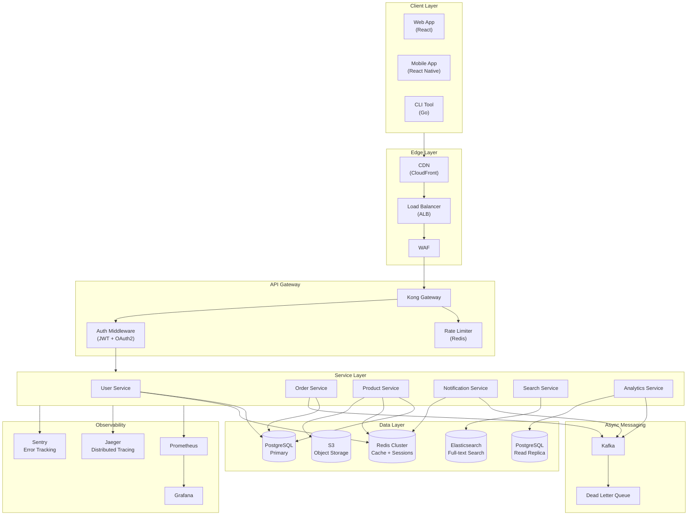
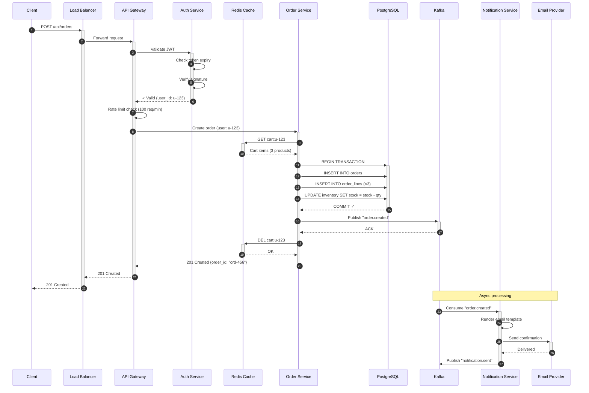
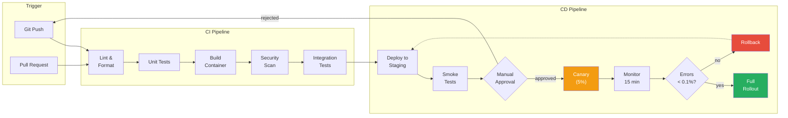
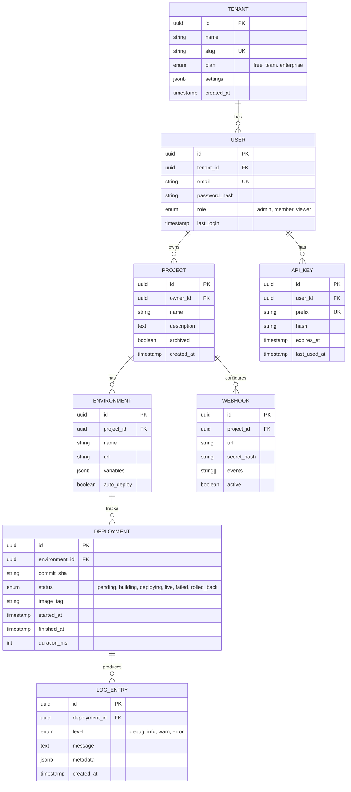

# Platform Architecture

## System Overview

High-level view of the distributed platform showing all major services and their communication patterns.

## Request Lifecycle

Detailed sequence showing how a typical API request flows through the system, including auth, caching, and async processing.

## Deployment Pipeline

CI/CD pipeline showing the full path from code commit to production deployment with quality gates.

## Data Model

Entity relationship diagram for the core domain model.

